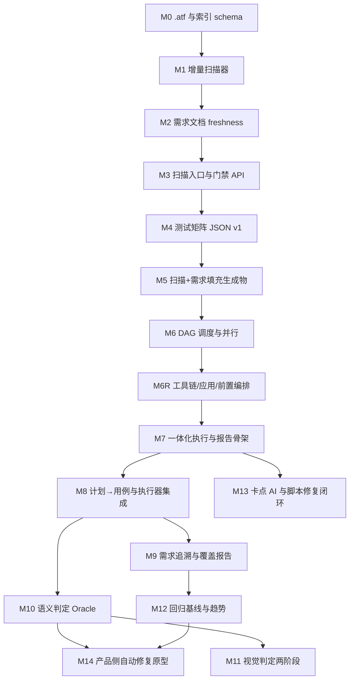

# ATF 详细 Roadmap（v2 · 从零视角）

本文档在下列文档之间对齐，给出**可交付里程碑、依赖关系、验收要点**与**测试类型矩阵**：

- [ATF_PIPELINE_AND_SCAN_SPEC.md](./ATF_PIPELINE_AND_SCAN_SPEC.md)（**《流水线规格》**）：增量扫描、`.atf/`、JSON 生成物、可选 L1 AKP 子阶段、DAG、卡点归因、脚本优先修复等**产品契约**。  
- [AI_AUTOMATED_TESTING_SYSTEM.md](./AI_AUTOMATED_TESTING_SYSTEM.md)（**《体系说明》**）：双视角、能力分层、阶段目标。  
- [AUTOMATION_KNOWLEDGE_AND_AI_LAYER.md](./AUTOMATION_KNOWLEDGE_AND_AI_LAYER.md)（**《自动化知识包与 AI 语义层》**）：L0/L1 分工、AKP 字段、全自动化工程化分阶段与安全约束。  
- [TECHNICAL_OVERVIEW.md](./TECHNICAL_OVERVIEW.md)（**《技术总览》**）：逻辑部件、数据流、扩展点；里程碑交付物可映射到该文中的命名边界。  
- [Playwright原理与Web游戏自动化对照.md](../Playwright原理与Web游戏自动化对照.md)（**《Web/引擎对照》**，可选阅读）：浏览器自动化分层、**与原生引擎宿主的边界**、像素截图回归与引擎内输入原则；用于校准 M6R/M11/M12 的交付语义，**不增加新里程碑编号**。

**Roadmap 原则：** 里程碑描述**能力与契约**，不绑定编程语言、框架或目录结构（除 `.atf/` 等规格已拍板项）；每一阶段在「测试计划 / 任务 JSON」中对**全部测试类型**有条目，未实现者 **`skipped` + `reason`**（见《流水线规格》5.2）；执行语义须对齐《体系说明》2.3 与《流水线规格》5.3 的 **工具链 → 应用 → 前置条件 → 验收** 链路。**实现侧**与《技术总览》§2 **工程原则**一致：分层与依赖方向清晰、编排可观测、契约与版本化优先、抽象与扩展点与问题规模匹配。

---

## 1. 北极星与双轨关系

### 1.1 北极星

```text
认知更新（扫描 + 需求）→（可选）L1 自动化知识包 AKP → 生成 → 编排运行与环境就绪 → 执行 → 判定 → 报告 → 回归 →（可选）修复与再验证
```

终态：系统能理解需求与实现索引、编排从空环境到可验收状态、模拟玩家路径、区分脚本/环境与产品问题，并在策略允许下**优先修复测试资产后重跑**；长期可选目标包含《体系说明》3.4 的**产品侧修复闭环**。

### 1.2 双轨合并

| 轨道 | 侧重 | 主要对齐文档 |
| --- | --- | --- |
| **P（流水线）** | `.atf/`、增量扫描、freshness、统一 JSON、DAG、卡点报告与归因 | 《流水线规格》 |
| **A（体系能力）** | 计划→用例、追溯、语义判定、视觉判定、基线回归、自动修复 | 《体系说明》3–4、6 |

里程碑编号 **M0–M14**；**M0–M6R** 偏流水线基础设施与运行时编排，**M7+** 与《体系说明》Phase 1–4 **交织**（见下文总览图）。

---

## 2. 测试类型全量矩阵

以下 `type_id` 须在**各阶段**的测试计划 / 任务 JSON 中出现（`executable | skipped` + `reason`）。语境对齐《体系说明》2.1、2.2、3。

### 2.1 开发者视角

| `type_id` | 说明 |
| --- | --- |
| `unit` | 单元测试 |
| `integration` | 集成测试 |
| `contract` | 契约测试 |
| `functional` | 功能测试 |
| `business_flow` | 业务流程测试 |
| `regression` | 回归测试 |
| `state_validation` | 状态校验测试 |

### 2.2 玩家视角

| `type_id` | 说明 |
| --- | --- |
| `e2e` | 端到端测试 |
| `ui_automation` | UI 自动化测试 |
| `player_journey` | 玩家路径测试 |
| `exploratory` | 探索式测试 |
| `experience` | 体验测试 |
| `compatibility` | 兼容性测试 |
| `long_run_stability` | 长流程稳定性测试 |

### 2.3 扩展能力簇

执行时可挂载为 `capabilities[]`、Oracle 插件或配置块（不必各为独立 `type_id`）：

| 能力簇 | 内容 | 里程碑侧重 |
| --- | --- | --- |
| `stability` | 崩溃/日志判定、超时、卡死检测、随机探索 | M8+ |
| `ai_judge` | 语义判定 PASS/FAIL/UNKNOWN | M10 |
| `visual` | 规则型 → 多模态型视觉判定 | M10–M11 |
| `traceability` | requirement → case → result | M9 |
| `baseline` | 状态/日志/画面指纹与 diff；**含像素级截图基线**（容差、掩膜、ROI，与 Playwright 视觉对比同类） | M12 |
| `auto_fix` | 证据聚合 → 补丁草案 → 重跑 | M14 |

### 2.4 运行时能力（与类型矩阵正交）

| 能力项 | 说明 | 里程碑 |
| --- | --- | --- |
| `toolchain_launch` | 启动引擎/工具链并就绪 | M6R |
| `app_launch` | 启动被测应用并建立控制通道 | M6R |
| `world_preconditions` | 登录、进度、服务器、开关等声明式准备 | M6R、M8 |
| `readiness_gate` | 前置未满足不进入验收；报告分阶段 | M6R、M7 |

命名上「工具链 / 应用」涵盖 Unity 编辑器、批模式、独立 Player 等具体形态，由项目配置映射。

---

## 3. 里程碑总览（逻辑依赖）



**M6R** 将《流水线规格》5.3 固化为可编排实现；依赖 M6 以便将运行时根层与任务图组合。**M13** 可与 **M7–M8** 并行迭代；图为逻辑顺序，人力允许时可拆并行。

---

## 4. 分里程碑说明

### M0 — `.atf/` 与索引 Schema

**目标：** 落地《流水线规格》§3.4–3.6 的物理与逻辑契约（存储位置、可选语义层、`.atf/` 根名）；其中 **L1 AKP** 的生成与消费为后续里程碑，契约见《自动化知识包与 AI 语义层》。

**交付物：** 目录结构规范文档；`scan_index.json`（或等价）的 schema：`version`、`rule_version`、`files[]`（`path`、`hash`、`size`、`last_analyzed_at` 等）、可选 `prd` 段（`path`、`hash`）。

**验收：** 不启动被测应用即可用单元测试校验 schema 与版本迁移策略。

**依赖：** 无。

---

### M1 — 增量扫描器

**目标：** 《流水线规格》3.1：基于哈希的增量分析。

**交付物：** 扫描根配置；遍历与哈希；与旧索引 diff；仅对变更文件调用分析并合并；`rule_version` 变化时的失效策略与测试。

**验收：** 修改单个源文件后二次扫描，分析调用量或耗时相对全量显著下降（可用临时目录 fixture）。

**依赖：** M0。

---

### M2 — 需求文档（Markdown）Freshness

**目标：** 《流水线规格》第 4 节。

**交付物：** 将需求路径与内容哈希写入索引或独立指纹文件；提供「项目 + 需求是否仍最新」的 API 语义。

**验收：** 仅改需求不改代码时门禁要求更新；仅改未索引文件的边界行为符合设计说明。

**依赖：** M0、M1。

---

### M3 — 扫描专用入口与门禁 API

**目标：** 《流水线规格》第 2 节「仅扫描」可单独触发。

**交付物：** 可被 CI 与「一体化执行」复用的扫描 API；对外 CLI 或等价入口（具体名称实现自定）。

**验收：** 帮助信息与 dry-run 行为有自动化测试覆盖。

**依赖：** M1、M2。

---

### M4 — 测试矩阵 JSON v1（全类型占位）

**目标：** 《流水线规格》5.2：全类型 + `skipped` + `reason`；为 **runtime / preconditions** 预留字段（可为空对象但键存在）。

**交付物：** `test_matrix.v1.json`（名称可配置）schema：`schema_version`、`types[]` 覆盖 §2 全部 `type_id`，每项含 `status`、`reason`、`depends_on`（可空）、`artifacts_ref`（可空）；可选顶层 `runtime`。

**验收：** CI 或本地校验脚本：生成 JSON 缺任一枚举即失败。

**依赖：** M2（输入含需求指纹）；可不依赖真实游戏。

---

### M5 — 从「扫描 + 需求」填充生成物

**目标：** 将分析管线输出与 M4 JSON 合并；AI 为可选加速，不得破坏无 AI 时的契约完整性。

**交付物：** 映射层：管线输出 → 各 `type_id` 的摘要、推荐用例引用等；不可生成时写入明确 `reason`。

**验收：** 在无外部模型或 stub 模型下仍产出合法、枚举完整的 JSON。

**依赖：** M4、分析管线（与 M1 产物衔接）。

**与 AKP（L1）的关系（规格已对齐，实现可分期）：** 《流水线规格》5.2 允许在门禁通过后生成或更新 **AKP JSON**（落盘 `.atf/artifacts/`），再进入矩阵填充；矩阵映射层可逐步读取 AKP 以丰富摘要与执行提示（见 [TODO.md](./TODO.md) M5.5–M5.6）。AKP **不得**替代 L0 freshness；失败时阻断或降级须可配置并文档化。

---

### M6 — DAG 任务调度与并行

**目标：** 《流水线规格》5.4。

**交付物：** 从 JSON 读取依赖、拓扑分层、同层并行（进程或异步，可配置并发上限）；为各 `type_id` 定义**执行适配接口**（每类型一执行器或统一 runner 内分支均可）。

**验收：** fixture 依赖图验证顺序、最大并行度、环检测与错误报告。

**依赖：** M5。

---

### M6R — 运行时编排：工具链、应用、前置条件

**目标：** 《体系说明》2.3、《流水线规格》5.3。

**交付物：** 统一编排抽象：工具链就绪、应用就绪、控制通道就绪、前置谓词全部满足；**前置清单 schema**（超时、重试、结构化错误码）；与 M6 集成（默认编排链为根或唯一前驱链）。宿主可为 **原生 Player/编辑器** 或 **WebGL+浏览器** 等；通道实现应对齐《Web/引擎对照》中的分层思想（进程外编排 + 双向控制/事件），**不得**对原生宿主默认假设 DOM 定位可用。

**验收：** 无真实服务器时可用 mock/stub 跑通链路与报告字段；真实项目至少打通「工具链 + 应用 + 一条简单前置（如进入主界面）」。

**依赖：** M6。

---

### M7 — 一体化执行与 `.atf/reports/` 报告骨架

**目标：** 《流水线规格》5.1–5.5、第 6 节；含 M6R 的完整时间序至卡点分析。

**交付物：** 「执行自动化测试」：项目根 + 需求路径 → 门禁扫描 → 生成 JSON → M6R → DAG 执行 → `reports/run_<id>.json`（及可选 Markdown）；报告含 **runtime / precondition / acceptance** 分段、各类型状态、耗时、证据路径占位。

**验收：** dry-run 或 mock 执行器可端到端跑通；报告能区分前置失败与验收失败。

**依赖：** M3、M6R。

---

### M8 — 测试计划 → 可执行用例与执行器深度集成

**目标：** 《体系说明》Phase 1。

**交付物：** 将 M5/M7 中 `executable` 项转为用例中间表示或最终格式；显式 **preconditions / environment** 并与 M6R 对接；报告字段稳定。

**验收：** 至少 `functional` 与 `e2e` 或 `ui_automation` 在 mock 或真实环境下可跑通；样例含至少一条依赖前置的用例。

**依赖：** M7。

---

### M9 — 需求追溯（Requirement Traceability）

**目标：** 《体系说明》Phase 1 中「最小追溯」扩展为覆盖报告。

**交付物：** `requirement_id → test_point_id → test_case_id → run_result` 及报告区块；需求 Markdown 解析规则（可先约定标题/列表格式）。

**验收：** 样例需求文档可展示覆盖数、未覆盖列表、每条最近一次结果。

**依赖：** M8。

---

### M10 — 语义判定 Oracle

**目标：** 《体系说明》3.3、Phase 2。

**交付物：** 判定插件：输入意图、步骤、画面、日志、状态、期望摘要；输出 PASS/FAIL/UNKNOWN、理由、置信度、疑似问题、建议补充证据；步骤级可挂载。

**验收：** mock 判定器契约测试；输出字段与《体系说明》一致。

**依赖：** M8。

---

### M11 — 视觉判定（两阶段）

**目标：** 规则型、像素型与多模态型分层引入；与《Web/引擎对照》第五节「像素比对以数学 diff 为主、非默认 AI」一致。

**交付物：** 阶段 1：元素存在/可见/越界、黑屏、弹窗状态等 **规则** 判定，以及 **像素/区域 diff + 容差/掩膜**（引擎或宿主提供的帧缓冲/截图管线）；阶段 2：可选多模态语义插件，共用证据管道与报告，与 M12 的基线存储正交（M11 偏单次判定插件，M12 偏历史与趋势资产）。

**验收：** 阶段 1 可离线测；阶段 2 可用特性开关关闭。

**依赖：** M10（证据管道）、执行侧画面采集能力。

---

### M12 — 回归基线、Diff、趋势

**目标：** 《体系说明》Phase 3。

**交付物：** `.atf/baselines/` 或等价：状态快照、日志摘要、**Approved 参考帧与像素指纹**、历史 run 索引；报告回答新增失败、与历史同类失败、影响面。截图基线策略（入库范围、人工审批门槛）由项目约定，对照文 **第五节（像素对比）** 与 **第三节工具链/引擎内路径** 可作选型参考。

**验收：** 两次运行间人为注入 diff 可被检出。

**依赖：** M9、稳定报告 schema。

---

### M13 — 卡点 AI、脚本 vs 产品归因、脚本优先修复与重跑

**目标：** 《流水线规格》5.5。

**交付物：** 硬/软/质量卡点分类；归因标签与置信度；脚本类可生成补丁建议并**可选**自动应用（如仅限测试资产）后重跑子图；产品类只记缺陷与证据。

**验收：** 黄金样例：故意错误测试资产 vs 故意错误产品行为，归因方向符合预期（可用固定 stub 起步）。

**依赖：** M7+；可与 M10 共用模型网关。

---

### M14 — 产品侧自动修复闭环（原型 → 生产）

**目标：** 《体系说明》3.4、Phase 4。

**交付物：** 失败证据聚合 → 定位相关源码 → Patch 草案（默认 dry-run 或人审）→ 目标用例重跑 → 相关回归子集；审计日志与路径越权防护。

**验收：** 仅在显式策略开启时允许写产品工程；默认不静默写盘。

**依赖：** M12、M13、M10。

---

## 5. 体系阶段与里程碑对应（沟通用语）

| 《体系说明》阶段 | 里程碑粗对应 |
| --- | --- |
| Phase 1 可执行闭环 | M4–M9（核心贯通 M7–M8） |
| Phase 2 体验与智能判定 | M10–M11 |
| Phase 3 回归运营 | M12 |
| Phase 4 闭环加深 | M13–M14 |

**规格闭环 Beta（含启动与环境）** 可对外表述为：**M0–M6R–M7**。

---

## 6. 风险与缓解

| 风险 | 缓解 |
| --- | --- |
| 全类型并行开发碎片化 | JSON 全枚举 + skipped reason；每迭代只加深少数类型的执行器 |
| `.atf/` 与版本控制 | 文档化默认 ignore 建议；基线是否入库由项目策略决定 |
| 模型成本与 flaky | UNKNOWN 不自动改脚本；置信度阈值与人审通道 |
| CI 不稳定 | 重试、超时、与 M6R 分段报告 |
| 联网前置慢或 flaky | 超时/重试/可选跳过非必需步骤；报告明确 precondition 阶段 |
| 前置与验收混淆 | 报告 schema 强制分栏/分字段 |

---

## 7. 文档维护

修订本 Roadmap 时，同步检查《流水线规格》《体系说明》《自动化知识包与 AI 语义层》《技术总览》与《Web/引擎对照》交叉引用是否仍一致；**产品语义**以《体系说明》《流水线规格》为准，《技术总览》为分解视图，**AKP 字段与 L0/L1 边界**以《自动化知识包》为准；五者冲突时先改总览或 Roadmap 映射而非弱化契约。若宿主或通道设计有争议，优先回到《体系说明》§2.4 与《Web/引擎对照》全文对齐后再改里程碑表述。

---

## 8. 修订记录

| 日期 | 说明 |
| --- | --- |
| 2026-04-30 | 从零视角重写；统一 `toolchain_launch` 等命名；对齐《Web/引擎对照》；文首增加《技术总览》与 §7 四文档维护说明；Roadmap 原则与《技术总览》§2 对齐。 |
| 2026-04-30 | Roadmap 原则「实现侧」句改为引用《技术总览》§2 工程原则（分层、可观测、契约优先等），删「目录/最少依赖/不先上大框架」表述。 |
| 2026-04-30 | 文首与 §1.1 北极星：纳入可选 L1 AKP；M0 目标对齐《流水线规格》§3.4–3.6；M5 增补与 AKP 关系；§7 文档维护增加《自动化知识包》。 |
